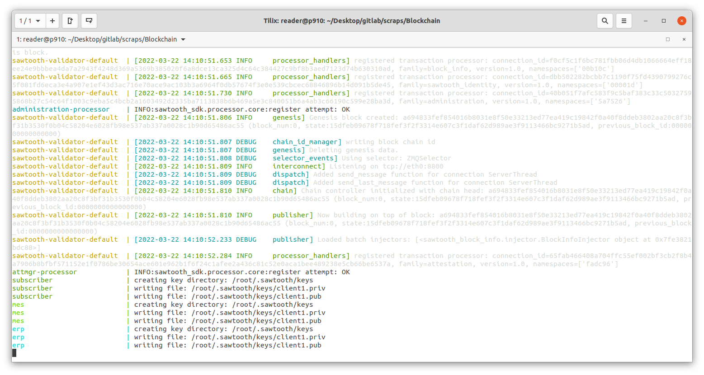
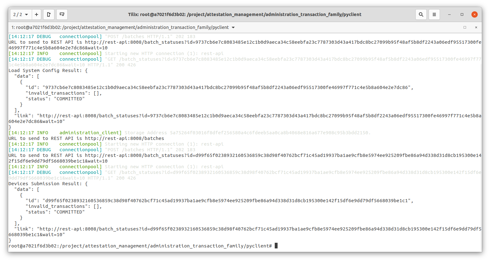
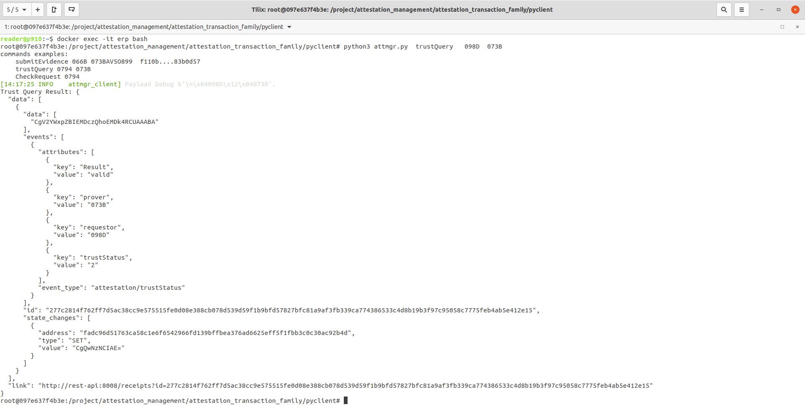
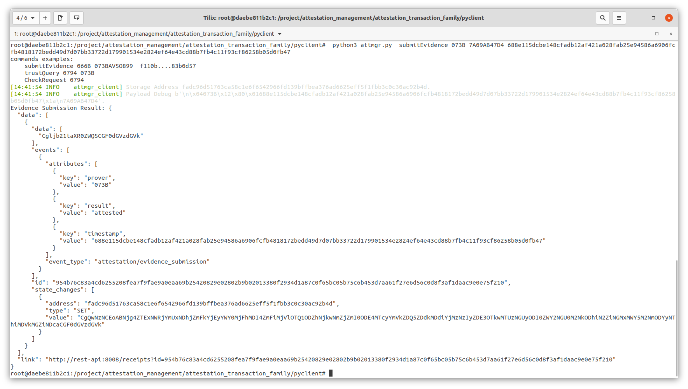
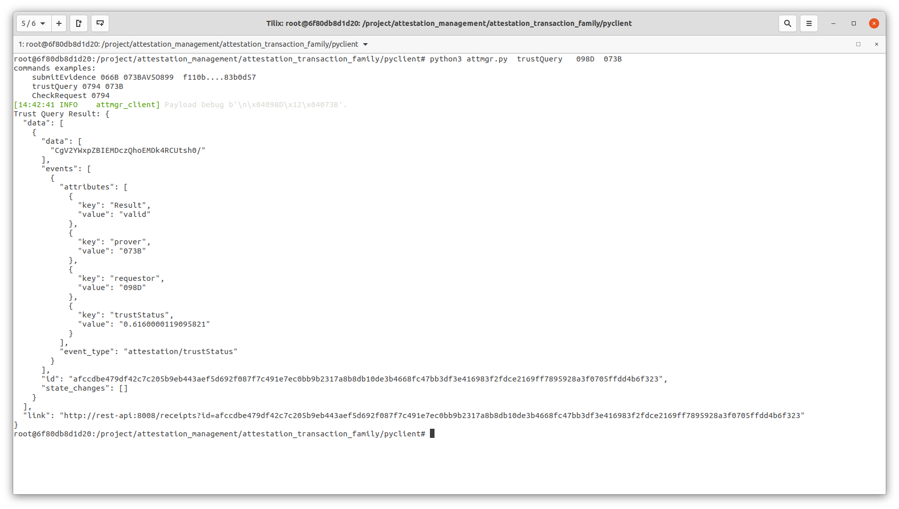

#  SCRAPS: Scalable Collective Remote Attestation for Pub-Sub IoT Networks with Untrusted Proxy Verifier

## Blockchain
Implementation of Sawtooth blockchain, including smart contracts and 3 entities implemented also in containers, namely the administrator and 2 clients with roles of Verifer and Prover. The code is deployed using docker and docker-compose. 
The directory contains the code needed to build the test network.
It includes the necessary files to start Sawtooth hyperledger.
Moreover, the implementation for Manufacture client, smart contracts, SCRAPS attestation client and smart contract.


### I. Requirements
- docker
- docker-compose

### II. How to use
#### 1. Build Network

The network is composed of Sawtooth hyperledger, broker ,and different containers running the code for Manufacture client, and IoT devices.
Administrator container hosts the code necessary to upload configuration information to the blockchain. It, furthermore runs the code for Manufacture client.
mes container is used as a prover, while erp is used as a verifier.
Manufacture and Blockchain communicate directly using http. Communication between IoT devices and blockchain is mediated by a broker.

The network is built using the following command


```console
foo@bar:~$ docker-compose -f test.yml up

```
The output is shown in the following picture. The console keeps printing log information submitted by different containers in the network



## 2. System configuration:
The next step is to upload the configuration information to Sawtooth. This task is executed from the administrator container.
The following commands are used to login to admin client container (Manufacturer client), upload systemconfig and devices DB.

```console
foo@bar:~$ docker exec -it administrator-client bash
foo@bar:~$ python3 administration.py  loadSystemConfig &&  python3 administration.py  loadDeviceDB 

```
The output shows how the transactions are submitted and the results of the execution of those transactions.


### b. Start MQTT client on rest-api docker

As Sawtooth does not support MQTT, the next step is to run a MQTT middlebox on rest-api container.
The task of the middlebox is to enable MQTT communication between IoT devices and the blockchain.
The following commands are used to login to rest-api container and start the middleware.


```console
foo@bar:~$ docker exec -it sawtooth-rest-api-default bash
foo@bar:~$ cd project/attestation_management/middlebox
foo@bar:~$ python3 Mqttc.py
```


### 2. Attestation
After the configuration of the network is finished, IoT devices (mes and erp containers) can start using the attestation service provided by the blockchain.
In the following, mes container is used as a prover, while erp as verifier.
#### mes: Check for pending requests 
Next commands are used tologin to mes (prover with ID 073B) container, and check if it has any pending request


 ```console
foo@bar:~$ docker exec -it mes bash
foo@bar:~$ python3 attmgr.py  checkRequest  073B
```
As no other device queried the state of mes (073B), "AttestationRequired" has the value "False".

##  erp (verifier with ID 098D) queries state of mes 
In this step, erp, acting as a prover, queries the blockchain for the state of mes.

```console
$ docker exec -it erp bash
foo@bar:~$ python3 attmgr.py  trustQuery   098D  073B   
```
 The output shows the result of the query sent back from the blockchain. "TrustStatus" has the value 2
 , which means attestation is pending. The attestation smart contract sets a flag for mes signaling that its attestation is required.


#### mes: check if any pending request,
mes checks if any pending requests on the blockchain once again
```console
foo@bar:~$ python3 attmgr.py  checkRequest  073B
```
In the response, "AttestationRequired" has the value true. "timestamp" field includes the ID of last written block in the blockchain.

#### submit an evidence 
mes uses the ID of the block received in the last check request operation, and submits a new evidence.
```console
foo@bar:~$ python3 attmgr.py  submitEvidence 073B 7A09AB47D4 688e115dcbe148cfadb12af421a028fab25e94586a6906fcfb4818172bedd49d7d07bb33722d179901534e2824ef64e43cd88b7fb4c11f93cf86258b05d0fb47
```

#### erp query blockchain for mes state 
```console
foo@bar:~$ python3 attmgr.py  trustQuery   098D  073B   
```

#### Other cases:

- If mes submits evidence with a wrong or old block ID, the result for erp querying the blockchain for its state will have 2 (pending) as a value for "TrustStatus"
- if mes submits evidence with measurement different than the one saved in blockchain (7A09AB47D4), the result for erp querying the blockchain for its state will have 3 (untrusted) as a value for "TrustStatus"


## IoT-Clients
C implementation of IoT client in 2 boards (LPCXpresso55S69 + Mikroe WiFi 10 Click and Atmel MEGA-1284P Xplained). 

## Simulation
Python code used in the scalability evaluation.
